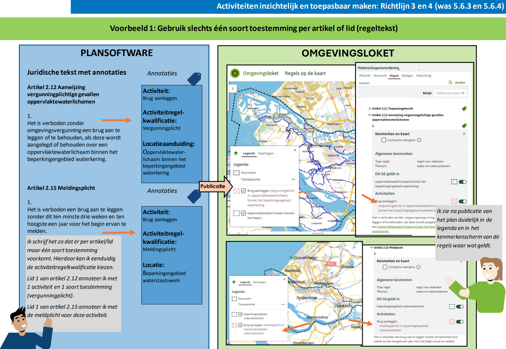

# Richtlijn 1.1: Regeling en ambtsgebied

**Richtlijn 1.1: Elk OW-object hoort bij één regeling**
----------------
Ieder OW-object (Regeltekst, Juridische regel, Locatie, Gebiedsaanwijzing, Activiteit, Omgevingsnorm of Omgevingswaarde) hoort bij één regeling. We adviseren om iedere regeling eigen OW-objecten te geven en niet te verwijzen naar OW-objecten in een andere regeling. Verwijzen naar OW-objecten in een andere regeling kan en mag alleen bij hetzelfde bevoegd gezag. 

**Waarom doen we dit?** 

Locaties neem je altijd op als informatieobject in de bijlage van de regels binnen een omgevingsdocument. Je verwijst er dus niet naar vanuit andere omgevingsdocumenten. Dit geldt in principe ook voor andere zaken, zoals activiteiten​,​ ​     ​. 

Bijvoorbeeld: 
- Een provincie mag niet verwijzen naar het Natura 2000-gebied in het aanwijzingsbesluit van het Rijk.  
- Een gemeente mag niet verwijzen naar het glastuingebied in de omgevingsverordening van de provincie. 

Bij uitzondering kun je locaties hergebruiken uit andere omgevingsdocumenten van je eigen organisatie. Verwijs dan van zachte naar harde regels. Dit betekent dat je verwijst van een document met een minder bindend karakter (bijvoorbeeld een omgevingsvisie) naar een document met een bindend karakter (bijvoorbeeld een omgevingsplan). 

Deze regel is om juridische en technische redenen ingevoerd​. Een paar voorbeelden: ​​:​ 

1. Stel dat een omgevingsplan verwijst naar een locatie in de omgevingsverordening van de provincie. Als de provincie die locatie wijzigt, verandert de locatie in het omgevingsplan automatisch mee. Dit gebeurt zonder een besluit door de gemeenteraad of het college van burgemeester en wethouders (B&W) en zonder het volgen van de normale procedure met inspraak- en beroepsmogelijkheden. Het kan zelfs gebeuren dat de locatie na wijziging deels buiten het grondgebied van de gemeente valt. De gemeente stelt dan regels over een deel van de buurgemeente, zonder dat dit de bedoeling is. 

2. De provincie kan een locatie waarnaar het omgevingsplan verwijst niet beëindigen. Dit komt doordat de locatie in het omgevingsplan nog steeds in gebruik is. De provincie kan de locatie wel uit de omgevingsverordening verwijderen. Alleen, zolang de gemeente in het omgevingsplan naar de locatie verwijst, blijft de locatie in het DSO achter. De juridische grondslag voor de locatie is verdwenen, terwijl de gemeente er nog steeds naar verwijst. De gemeente krijgt hier geen melding van, waardoor het risico bestaat dat er regels worden gehandhaafd die geen grondslag meer hebben.  

3. Door niet te verwijzen naar objecten in andere regelingen, of alleen te verwijzen naar objecten in regelingen van hetzelfde bevoegd gezag, is het mogelijk om regelingen afzonderlijk te migreren naar een volgende versie van de standaard. Dit kan ook in kleine reeksen. 

4. De downloadservice van het stelsel valideert of de regeling verwijst naar objecten in een andere regeling. ​     ​
   Dit betekent dat het aanleveren van (een wijziging van) een regeling met een verwijzing naar een object in een regeling van een ander bevoegd gezag, wordt afgekeurd. 

​​​Deze richtlijn geldt ook voor de ​​instructieregels van de provincie. Hier worden gebieden geduid die de gemeente ook in het omgevingsplan moet opnemen. Daar mag je niet naar verwijzen. Zodra de provincie deze wijzigt, moet de gemeente ook het omgevingsplan wijzigen.​​ 

**Voorbeeld**
----------------
**Gebruik slechts één soort toestemming per artikel of lid (regeltekst)​**

