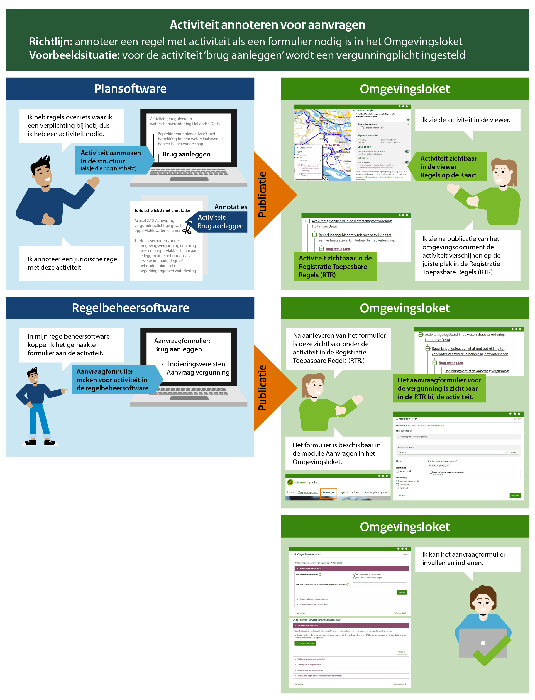

# Richtlijn 3.1 Activiteit annoteren voor aanvragen
----------------
Bevat een regel in een omgevingsdocument een vergunning-, meldings- of informatieplicht 1? Dan is het noodzakelijk minimaal één juridische regel met een activiteit te annoteren, zodat het mogelijk is het benodigde formulier in het Omgevingsloket te zetten. 

##Waarom doen we dit?##
Gemeenten, provincies, waterschappen en het Rijk moeten op grond van artikel 14.2 leden 1 en 3 Omgevingsbesluit de informatie beschikbaar stellen die nodig is om in de landelijke voorziening een formulier, inclusief indieningsvereisten, te maken voor:  

- Het aanvragen van een omgevingsvergunning;  
- Het doen van een melding;  
- Het voldoen aan een informatieplicht;  
- Het aanvragen van een maatwerkvoorschrift;  
- Het voldoen aan een informatieplicht ongewoon voorval;  
- Het doen van een melding gelijkwaardige maatregel;  
- Het aanvragen van een gelijkwaardige maatregel.  

Toepasbare regels kunnen uitsluitend aan het Omgevingsloket worden aangeleverd als ze gekoppeld zijn aan activiteiten die aanwezig zijn in de functionele structuur. De enige manier om activiteiten aan te leveren aan de functionele structuur is door ze te annoteren in een omgevingsdocument met artikelstructuur (en alleen bij regels van het type “regel voor iedereen”).  

Dit betekent dat je ten minste de regels over activiteiten die een vergunningplicht, meldingsplicht, informatieplicht, of een mogelijkheid om een maatwerkvoorschrift of toestemming voor gelijkwaardige maatregel aan te vragen, moet annoteren met een activiteit en de bijbehorende activiteitregelkwalificatie. Het betekent ook dat regels over activiteiten die je wilt aanbieden in een vergunningscheck moet annoteren met een activiteit.  

Als je die juridische regel annoteert waarin de plicht is opgenomen, is de relatie tussen regel en annotatie het meest direct. Ook is dan de kans klein dat in de toekomst de annotatie (per ongeluk) wordt verwijderd omdat de regel waarbij de annotatie is opgenomen niet de plicht bevat. 

Voorbeeld: De activiteit Brug aanleggen heeft een vergunningsaanvraagformulier nodig. Hoe je dit annoteert leggen we in het voorbeeld hieronder uit.  

_1 Bieden ze de mogelijkheid om een maatwerkvoorschrift of toestemming voor een gelijkwaardige maatregel aan te vragen? Voor het aanvragen van maatwerkvoorschriften en gelijkwaardige maatregelen zijn algemene formulieren in het loket beschikbaar. Annoteren van een activiteit is alleen noodzakelijk als je een eigen formulier wil maken met specifieke vereisten. Vaak zijn echter de vereisten voor dit soort activiteiten vrij algemeen en is het landelijke formulier toereikend._

**Voorbeeld**
----------------

