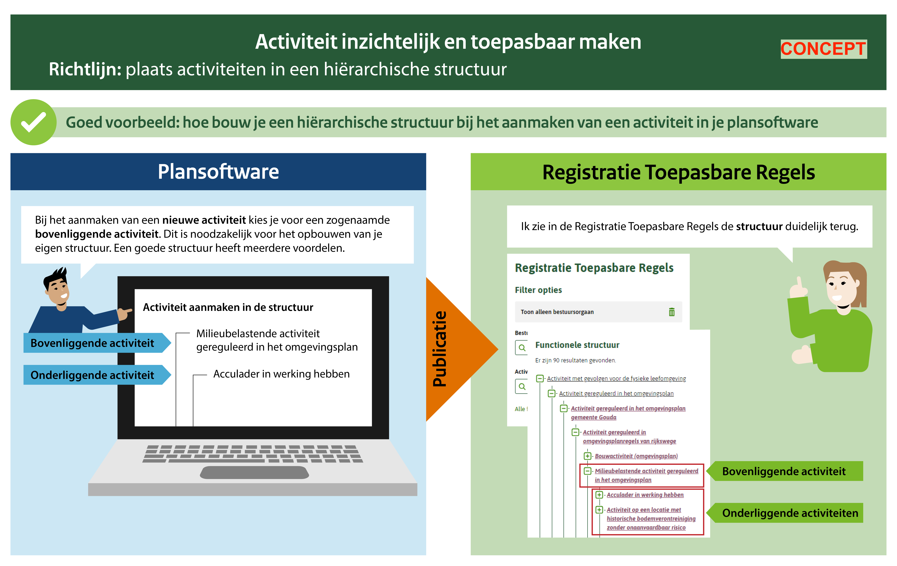
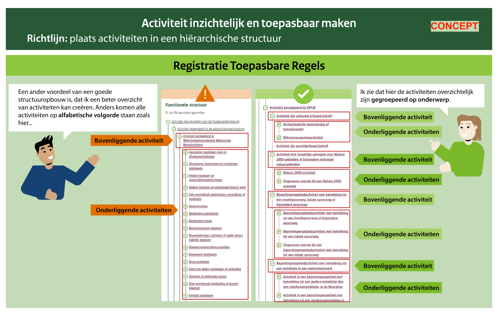
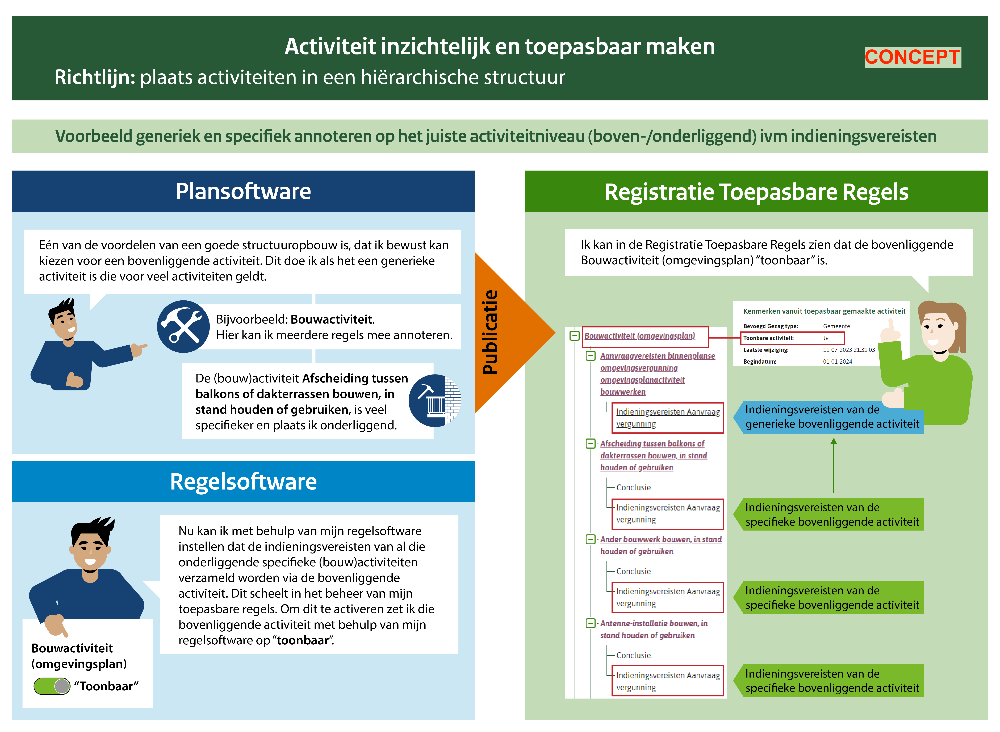
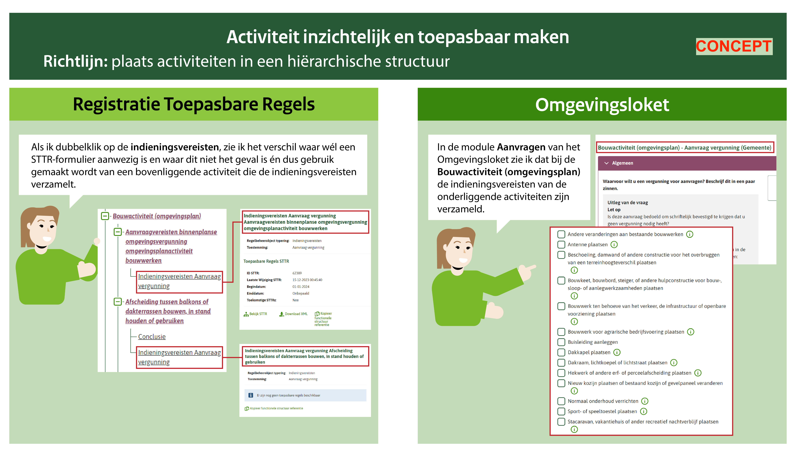
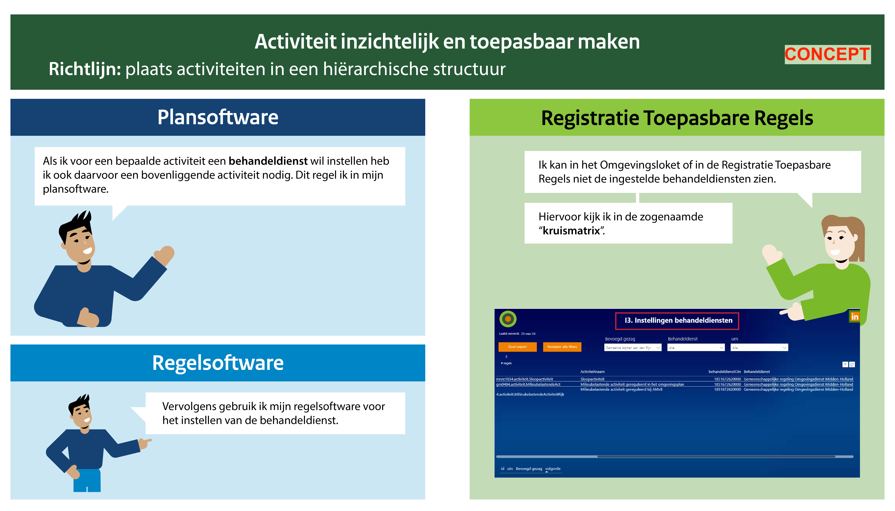

# Richtlijn 3.10 Plaats activiteiten in een hiërarchische structuur
----------------

> _**in bewerking**_

Plaats de activiteiten die horen bij een omgevingsdocument in een hiërarchische structuur door gebruik te maken van de relatie ‘bovenliggende activiteit’. Daarmee creëer je een boomstructuur van activiteiten waarin iedere activiteit precies één bovenliggende activiteit heeft en meerdere onderliggende activiteiten kan hebben.  

## Waarom doen we dit?

Er zijn drie redenen om activiteiten in een hiërarchische structuur te plaatsen. 

De eerste reden is dat het door de activiteiten hiërarchisch te structureren mogelijk is om generieke regels voor een verzameling activiteiten te laten gelden, terwijl je voor de specifieke activiteiten binnen die verzameling specifieke regels kunt stellen. De generieke regels annoteer je dan met de bovenliggende activiteit en de specifieke regels annoteer je met de juiste onderliggende activiteit. Een voorbeeld is de bovenliggende activiteit ‘Bouwwerk bouwen’ voor de generieke regels voor bouwwerken bouwen en meerdere onderliggende activiteiten voor de specifiekere regels voor bijvoorbeeld ‘Erfafscheiding bouwen’ en ‘Dakkapel bouwen’.  Zie hiervoor ook voorbeeld 3 in de visualisatie. Op deze manier kan je ook indieningsvereisten die van toepassing zijn op meerdere activiteiten annoteren met een bovenliggende (generiekere) activiteit. Indieningsvereisten die van toepassing zijn op meerdere activiteiten eenmalig opnemen in de regels vereenvoudigt het opstellen en beheer ervan en komt regelmatig voor. 

De tweede reden om te kiezen voor een hiërarchische structuur is het overzichtelijker maken van de verzameling activiteitannotaties in het omgevingsdocument. Een voorbeeld hiervan is de ‘Overige activiteit’ in de bruidsschat voor het omgevingsplan. Deze bovenliggende activiteit brengt een aantal bruidsschatactiviteiten bij elkaar die niet onder de bouwactiviteit of de milieubelastende activiteit in het omgevingsplan vallen.  

De derde reden voor een hiërarchische structuur is het makkelijker maken van het instellen van behandeldienst of conceptverzoek. Zo kan je bijvoorbeeld een reeks activiteiten die dezelfde behandeldienstinstelling hebben dezelfde bovenliggende activiteit geven en vervolgens de behandeldienstinstelling bij die bovenliggende activiteit vastleggen. Die instelling geldt dan voor alle onderliggende activiteiten. Hetzelfde is mogelijk voor het instellen van concept verzoek. Voor het rijk en provincies geldt hetzelfde voor het instellen van bevoegd gezag.  

Let op: de relatie ‘bovenliggende activiteit’ is niet hetzelfde als het attribuut ‘activiteitengroep’. Dat attribuut zorgt voor filteren en weergave van de symbolisatie van de activiteit op de kaart. 

**Bovenste en onderste activiteiten in een omgevingsdocument** 

De bovenste activiteit en de onderste activiteiten in een omgevingsdocument hebben bijzondere eigenschappen. Alleen bij de onderste activiteiten in de hiërarchische structuur kan je toepasbare regels aanleveren. 

De bovenste activiteit moet altijd wijzen naar een activiteit in de structuur zoals het Rijk die heeft klaargezet. De bovenste activiteit (ook wel: de tophaak) houdt de hele functionele structuur van activiteiten in het omgevingsdocument bij elkaar.  

Voor een tophaak gelden de volgende afspraken: 

- de naam van deze activiteit is: ‘Activiteit gereguleerd in [omgevingsdocument] [gemeente/provincie/waterschap] [naam bestuursorgaan]’; 
- de activiteit komt minimaal één keer voor in het omgevingsdocument, bij voorkeur in het artikel met begripsbepalingen; 
- alle andere activiteiten in het omgevingsdocument hebben direct of indirect deze activiteit als bovenliggende activiteit.  

Let op: de bovenste activiteit van een tijdelijk regelingdeel heeft als bovenliggende activiteit niet een activiteit in de structuur die het Rijk heeft klaargezet, maar de tophaak van het omgevingsdocument waar het tijdelijk regelingdeel bij hoort: [omgevingsdocument] [gemeente/provincie/waterschap/rijk] [naam bestuursorgaan]. 

**Voorbeelden**
----------------

**Voorbeeld 1**

**Voorbeeld 2**

**Voorbeeld 3A en 3B** 

Toelichting: Bij de toepasbare regels voor de ‘Bouwactiviteit (omgevingsplan)' in de bruidsschat voor het omgevingsplan is per onderliggende activiteit een vergunningcheck gemaakt. Deze afzonderlijke vergunningchecks zijn makkelijker te maken en onderhouden dan één vergunningcheck voor de ‘Bouwactiviteit (omgevingsplan)’. Het is ook makkelijk om de afzonderlijke vergunningchecks aan de juiste werkzaamheden te koppelen. Niet voor alle onderliggende activiteiten is een vergunningcheck gemaakt.  

Voor de ‘Bouwactiviteit (omgevingsplan) is één vergunningaanvraagformulier gemaakt. Dit is gedaan op verzoek van de bouwsector en omdat er één set aan aanvraagvereisten is opgenomen in artikel 22.35 van de bruidsschat. Dit formulier kan alleen worden opgenomen bij een onderliggende activiteit van de ‘Bouwactiviteit (omgevingsplan), omdat toepasbare regels alleen toegevoegd kunnen worden aan de onderste activiteiten in de hiërarchische structuur van activiteiten. Voor dit formulier is een aparte onderliggende activiteit toegevoegd: de activiteit ‘Aanvraagvereisten binnenplanse omgevingsvergunning omgevingsplanactiviteit bouwwerken’. Hierdoor is duidelijk bij welke onderliggende activiteit het aanvraagformulier is opgenomen. 

**Voorbeeld 4**

