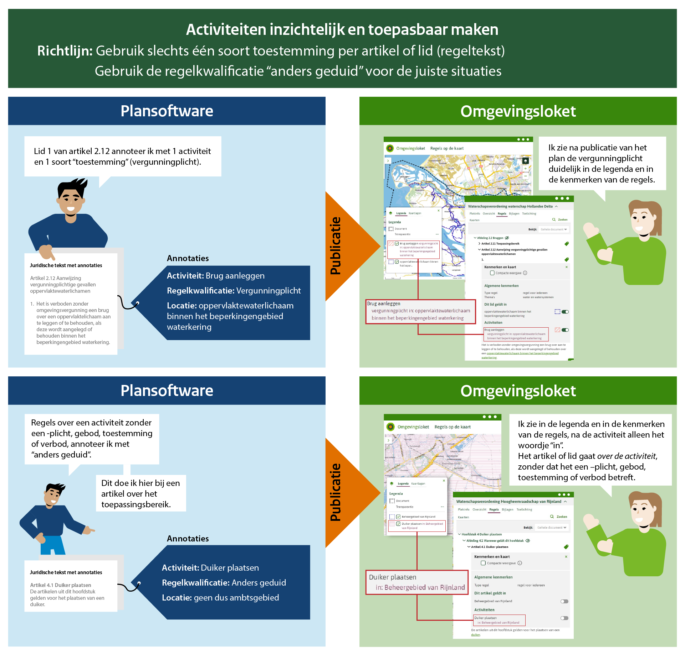

# Richtlijn 3.2 Pas de juiste activiteitregelkwalificatie toe
----------------

Voor het annoteren met activiteitregelkwalificaties1 is het prettig als een artikel of lid zo is opgeschreven dat er per artikel (of per lid als het artikel meerdere leden heeft) maar één soort ‘plichtkwalificatie’ voorkomt (vergunningplicht, meldingsplicht etc.). Dan kun je namelijk per artikel/lid één activiteitregelkwalificatie gebruiken.  

Je gebruikt de overeenkomende activiteitregelkwalificatie als de regel:  
- een gebod, informatieplicht, meldingsplicht, verbod, vergunningplicht of zorgplicht instelt, of beoordelingsregels of indieningsvereisten daarvoor bevat,  
- of bepaalt dat het verrichten van een activiteit en de algemene regels die daaraan gesteld worden, zonder toestemming is toegestaan. 

Je gebruikt de activiteitregelkwalificatie ‘anders geduid’ als:  
- de regel over iets anders gaat dan wat hierboven is genoemd; 
- de 'plichtkwalificatie’ alleen van toepassing is als is voldaan aan een voorwaarde die in het artikel of lid is genoemd; 
- de regel gaat over: 
  - Toepassingsbereik; 
  - Doelstelling; 
  - Oogmerk; 
  - Bevoegdheid tot het stellen van vergunningvoorschriften of maatwerkvoorschriften;  

Als je algemene regels stelt die gelden voor een specifieke activiteit, kun je de regelkwalificatie 'toegestaan’ gebruiken.  

In het geval van een vrijstelling op een verbod of vergunning/meldingsplicht adviseren wij deze te annoteren met de activiteitregelkwalificatie ‘toestemmingsvrij’. 

**Waarom doen we dit?**

Over het algemeen is het voor een lezer duidelijker als een artikel of lid over één ‘plichtkwalificatie’ gaat. Ook voor het beheer van toepasbare regels in relatie tot de juridische regels is dat wenselijk, omdat het bij het wijzigen van één activiteitregelkwalificatie eenvoudiger beheerd kan worden in de keten. Voor het raadplegen van een omgevingsdocument in een viewer geldt dat ook; het vereenvoudigt wat er gelezen moet worden. 

‘Anders geduid’ wordt niet getoond in de viewer; beperk daarom waar mogelijk het gebruik hiervan. Bij regels met een voorwaarde kan worden gekozen voor anders geduid (immers, bij de regel is een andere regelkwalificatie niet meteen van toepassing); ofwel kun je kiezen voor bv meldingsplicht, waarbij het dus gaat over een meldingsplicht onder voorwaarden.  
 
_1Activiteitregelkwalificatie is een kenmerk van de combinatie van activiteit, juridische regel en locatie. Dit kenmerk geeft aan wat de strekking van de regel over een activiteit op een bepaalde locatie is. Bijvoorbeeld: op deze plek geldt voor deze activiteit een verbod._

**Voorbeeld**
----------------
 
