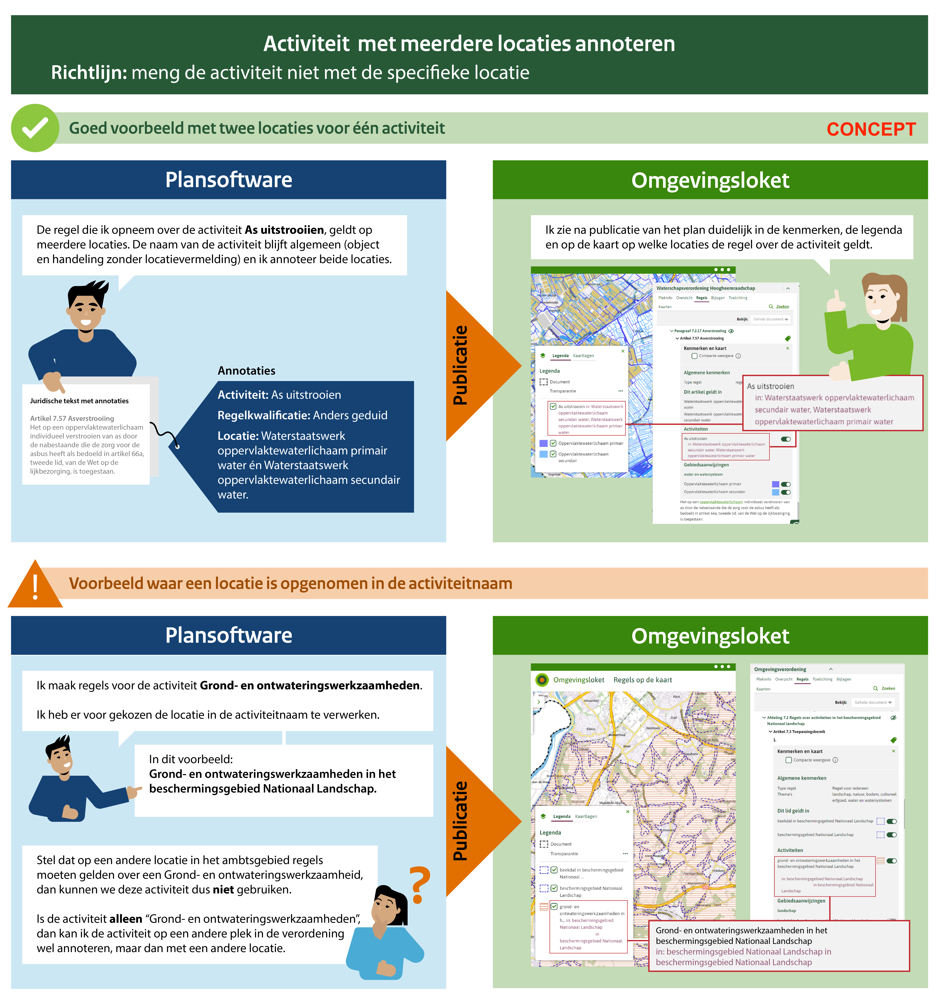

# Richtlijn 3.5 Meng de activiteit niet met de specifieke locatie 
----------------

> _**in bewerking**_

In de naam van de activiteit neem je niet de duiding van de locatie op. Alleen als het een onlosmakelijk inhoudelijk onderdeel is van de naam zoals ‘boren in de Noordzee’.  

Maak één activiteit waarvan de regels kunnen gelden op verschillende locaties. Regels die bij de activiteit horen, maar op verschillende locaties van elkaar verschillen, geef je een andere locatie mee.  

## Waarom doen we dit?

De naam van de activiteit laat zien dat het gaat om het verrichten van een activiteit. (een object met een handeling). De naam van de activiteit is wat anders dan de locatie waar de activiteit plaats vindt; bij het annoteren van activiteiten kijk je naar de activiteiten die iemand kan uitvoeren binnen het ambtsgebied. Regels en plichten worden gesteld per locatie en niet per activiteit. Zie daarvoor de richtlijnen over werkingsgebieden.  

Alleen als de regels op een locatie écht anders zijn dan op een andere locatie zet je de locatie in de naam. Een voorbeeld: voor ‘Boren in de Noordzee’ gelden inhoudelijk andere regels dan voor ‘Boren in het IJsselmeer’. 

De naam van de activiteit laat zien dat het gaat om het verrichten van een activiteit. Je maakt geen activiteit per locatie: 

- Omdat dit onhandig is bij het zoeken naar activiteiten op de kaart 
- Omdat het het maken en onderhouden van formulieren compliceert; immers, als je tien activiteiten over bv. het aanleggen van dakkapellen hebt als bevoegd gezag, allemaal op verschillende locaties, dan moet je evenzoveel formulieren daarvoor maken en onderhouden.  
- Omdat het het schrijven van regels (zowel juridische als toepasbare regels) onnodig complex maakt; je krijgt makkelijk dubbele regels of veel regels over hetzelfde. Je kijkt niet integraal en kunt dus ook niet integraal beheren.  

Momenteel worden locaties nog wel opgenomen in de naam van de activiteit, zie voorbeelden. Overweeg of het mogelijk is dit onderscheid te maken middels de naam van de locatie.  

**Locatie in activiteitnaam?** 

Er zijn een tweetal redenen genoemd waarom je eventueel wel een locatie op kan nemen in de naam van de activiteit: om een verschil aan te geven met andere bestuurslagen en als de naam van de activiteit anders nietszeggend is. Daarbij is het onderscheid tussen verschillende bevoegd gezagen op zich geen reden om een locatie toe te voegen aan de naam. Het is veeleer een voorbeeld van het opdelen van een activiteit in meerdere activiteiten, omdat een verzoek voor iedere activiteit naar een ander bevoegd gezag moet. Zie hiervoor [richtlijn 3.3](Richtlijn_3.3.md) en [richtlijn 3.10](Richtlijn_3.10.md). 

**Voorbeeld**
----------------

