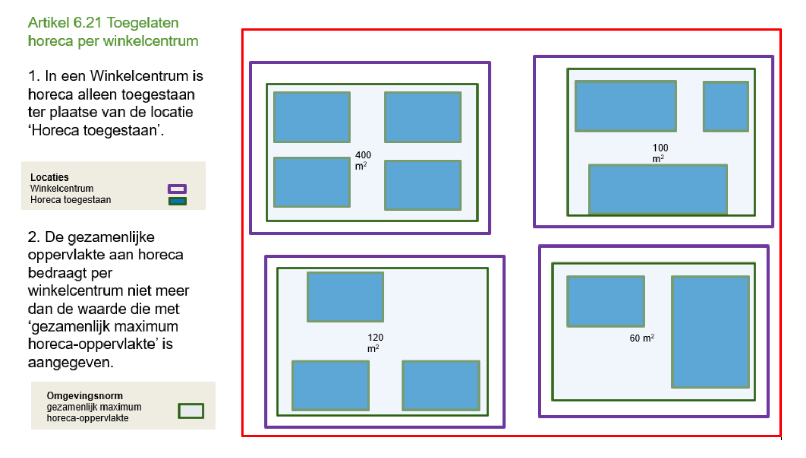

# Richtlijn 6.7 Waarde geldt voor individuele geometrie  
----------------

> _**in bewerking**_

De waarde van een Omgevingsnorm/Omgevingswaarde geldt per individuele geometrie, niet voor een verzameling geometrieën. Dit geldt ook voor multigeometrie en locatiegroep: de normwaarde geldt voor elke geometrie binnen de MultiSurface, MultiCurve of MultiPoint respectievelijk de gebiedengroep, lijnengroep of puntengroep. 

Een omgevingsnorm/omgevingswaarde mag geen gezamenlijke waarde hebben voor een verzameling geometrieën.  

## Waarom doen we dit?

De waarde op de kaart geldt altijd voor een individueel gebied en niet als een gezamenlijke waarde voor meerdere gebieden samen. 

Dit is een juridische randvoorwaarde. De informatiemodellen (IMOW en IMOP) maken geen duidelijk onderscheid tussen de waarde voor een individuele geometrie en een gezamenlijke waarde voor meerdere geometrieën. Hierdoor is een eenduidige juridisch verantwoorde weergave niet mogelijk. Deze richtlijnen, overgenomen uit gelijke werkafspraken, zorgen ervoor dat iedereen erop kan vertrouwen dat een viewer altijd de juridische bedoelingen van de opsteller toont. Daarom wordt vastgelegd hoe de opsteller de standaard moet toepassen en hoe geïnterpreteerd moet worden wat de viewer laat zien. 

Als een regel een gezamenlijke waarde voor meerdere geometrieën bevat, mag geen normwaarde als gezamenlijke waarde worden gebruikt. In plaats daarvan moet een alternatieve oplossing worden toegepast.
 
**Voorbeeld 1**
----------------
Met toepassing van omgevingsnorm/omgevingswaarde: koppelen van de normwaarde aan één geometrie die de geometrieën dekt waarvoor de gezamenlijke waarde geldt. 

**Voorbeeld 2**
----------------
Zonder toepassing van omgevingsnorm/omgevingswaarde: met een tekstuele oplossing.  

